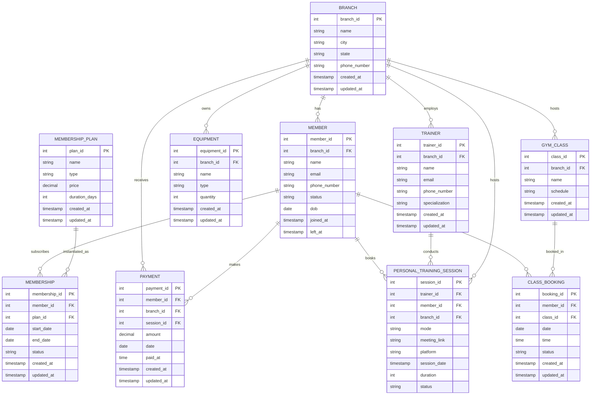

```mermaid
erDiagram
    BRANCH ||--o{ MEMBER : "has"
    BRANCH ||--o{ TRAINER : "employs"
    BRANCH ||--o{ EQUIPMENT : "owns"
    BRANCH ||--o{ GYM_CLASS : "hosts"
    BRANCH ||--o{ PAYMENT : "receives"
    MEMBER ||--o{ MEMBERSHIP : "subscribes"
    MEMBERSHIP_PLAN ||--o{ MEMBERSHIP : "instantiated_as"
    MEMBER ||--o{ PAYMENT : "makes"
    MEMBER ||--o{ PERSONAL_TRAINING_SESSION : "books"
    TRAINER ||--o{ PERSONAL_TRAINING_SESSION : "conducts"
    MEMBER ||--o{ CLASS_BOOKING : "books"
    GYM_CLASS ||--o{ CLASS_BOOKING : "booked_in"
    BRANCH ||--o{ PERSONAL_TRAINING_SESSION : "hosts"

    BRANCH {
        int branch_id PK
        string name
        string city
        string state
        string phone_number
        timestamp created_at
        timestamp updated_at
    }

    MEMBER {
        int member_id PK
        int branch_id FK
        string name
        string email
        string phone_number
        string status
        date dob
        timestamp joined_at
        timestamp left_at
    }

    TRAINER {
        int trainer_id PK
        int branch_id FK
        string name
        string email
        string phone_number
        string specialization
        timestamp created_at
        timestamp updated_at
    }

    MEMBERSHIP_PLAN {
        int plan_id PK
        string name
        string type
        decimal price
        int duration_days
        timestamp created_at
        timestamp updated_at
    }

    MEMBERSHIP {
        int membership_id PK
        int member_id FK
        int plan_id FK
        date start_date
        date end_date
        string status
        timestamp created_at
        timestamp updated_at
    }

    GYM_CLASS {
        int class_id PK
        int branch_id FK
        string name
        string schedule
        timestamp created_at
        timestamp updated_at
    }

    EQUIPMENT {
        int equipment_id PK
        int branch_id FK
        string name
        string type
        int quantity
        timestamp created_at
        timestamp updated_at
    }

    PAYMENT {
        int payment_id PK
        int member_id FK
        int branch_id FK
        int session_id FK
        decimal amount
        date date
        time paid_at
        timestamp created_at
        timestamp updated_at
    }

    PERSONAL_TRAINING_SESSION {
        int session_id PK
        int trainer_id FK
        int member_id FK
        int branch_id FK
        string mode
        string meeting_link
        string platform
        timestamp session_date
        int duration
        string status
    }

    CLASS_BOOKING {
        int booking_id PK
        int member_id FK
        int class_id FK
        date date
        time time
        string status
        timestamp created_at
        timestamp updated_at
    }
```
